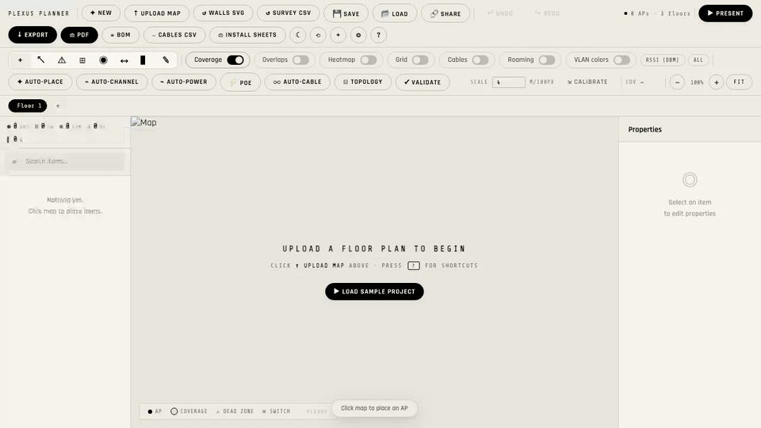
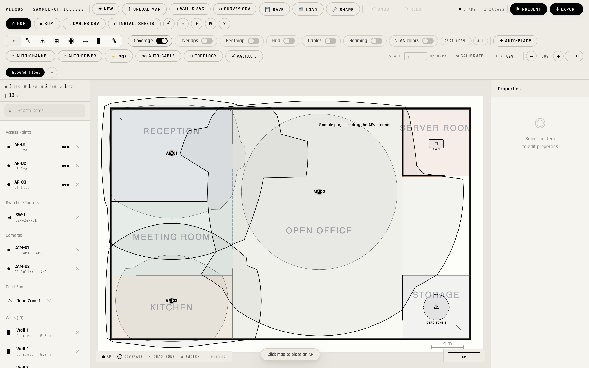
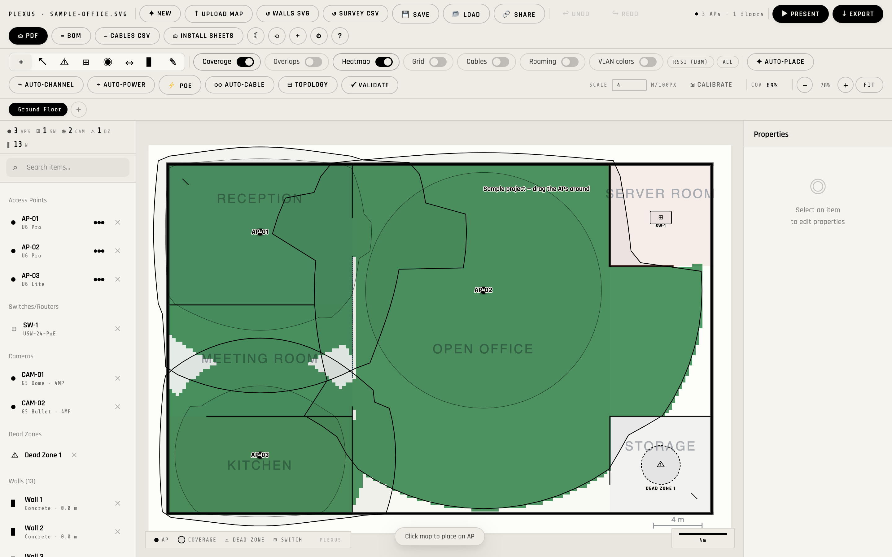
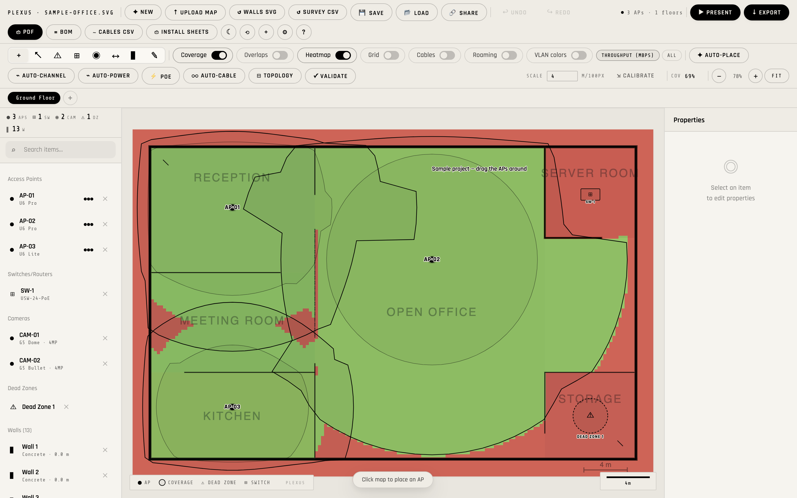
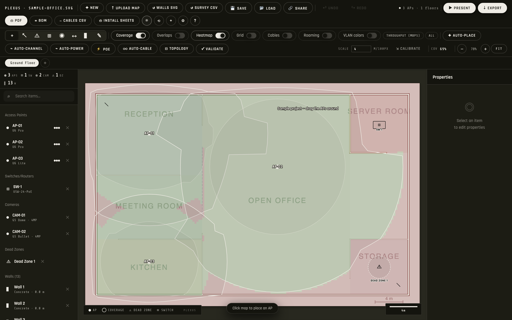
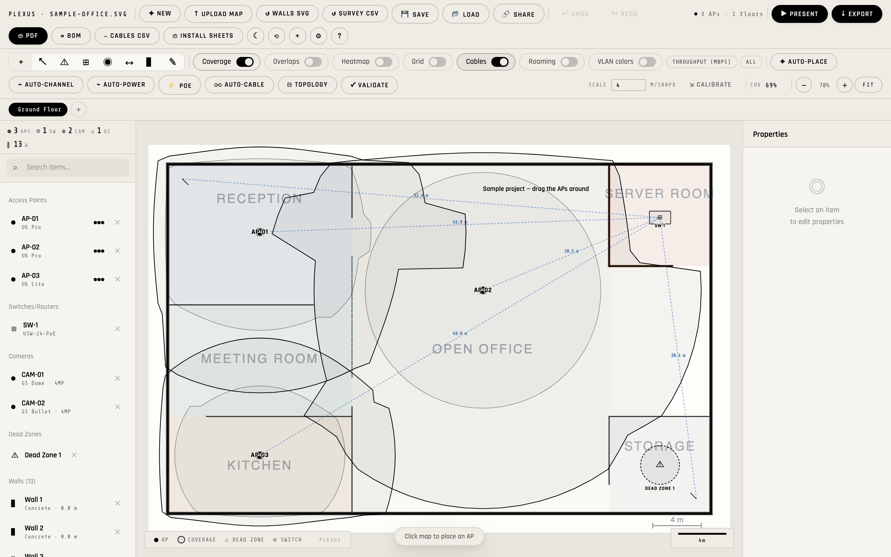
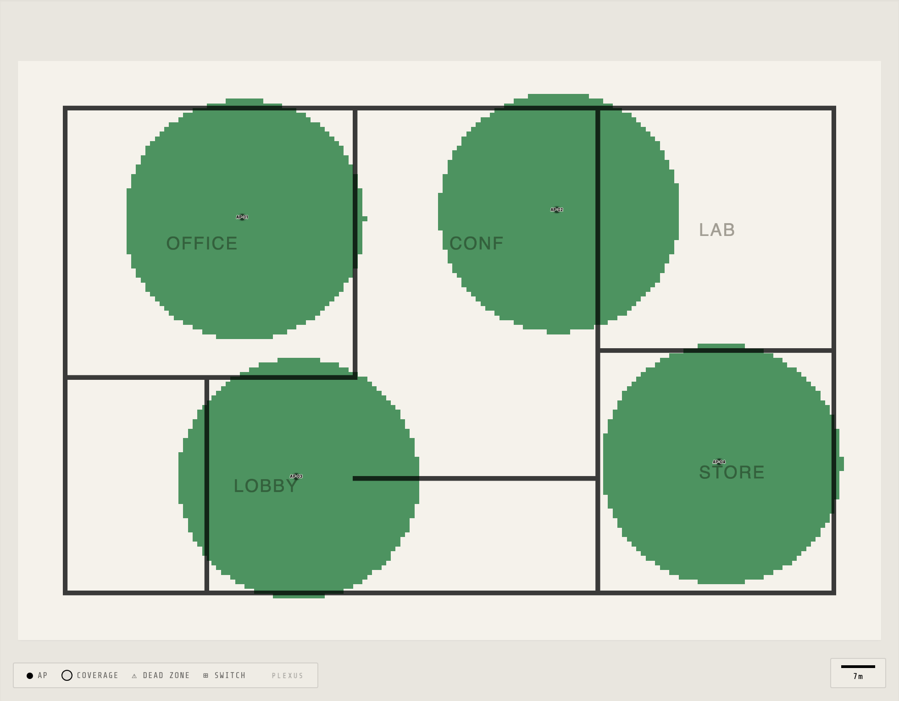

<h1 align="center">Plexus</h1>
<p align="center"><em>Network Site Planner — predictive WiFi, IP-camera and switch/PoE planning that runs anywhere.</em></p>

<p align="center">
<a href="https://github.com/SP1R4/plexus-network-planner/releases/latest"></a>
<a href="https://github.com/SP1R4/plexus-network-planner/actions/workflows/ci.yml"></a>

<a href="LICENSE"></a>

</p>

<p align="center"><strong><a href="https://sp1r4.github.io/plexus-network-planner/">▶ Try it in your browser</a></strong> — nothing to install; click <em>Load sample project</em>.</p>

<p align="center"></p>

Plexus is a **network site planner** that runs entirely in the browser or as a
native desktop app. Drop a floor plan, place access points, IP cameras and
switches, draw walls in different materials, and watch **wall-aware coverage
polygons + a real signal-strength heatmap** fall out of a ray-cast simulation in
real time — then design the wiring (PoE budgets, port maps, topology, cabling)
and hand off branded PDF / BoM / cable-schedule deliverables.

Predictive RF (SNR / throughput / MCS, selectable propagation models, regulatory
regions), multi-floor, band-aware (2.4 / 5 / 6 GHz), directional antennas, survey
import for predicted-vs-measured validation. **No backend. No accounts.** Projects
save to a JSON file you can email.

> **[Live demo](https://sp1r4.github.io/plexus-network-planner/)** — runs in any
> browser, deployed straight from `main`.
> **Download — [latest release](https://github.com/SP1R4/plexus-network-planner/releases/latest):**
> desktop installers for **macOS** (`.dmg`), **Windows** (`.exe`) and **Linux**
> (`.AppImage` / `.deb`), or the **portable browser zip** (unzip and open
> `index.html` — no install, fully offline). · [Changelog](CHANGELOG.md)

---

## Features

### Coverage modelling
- **Wall-aware coverage** — ray-cast simulation accumulates per-material
  dB attenuation (drywall, wood, glass, brick, concrete) for every wall
  the signal crosses. Each AP renders its actual reachable polygon, not
  a naive circle.
- **Band-aware** — 2.4 / 5 / 6 GHz APs apply different wall-loss
  multipliers because real RF doesn't care that they all use the same
  drywall.
- **Directional antennas** — omni, ceiling-down, wall-mount, sector
  90 / 60 / 30°. Coverage polygon is masked by the pattern + heading.
- **Real signal-strength heatmap** — canvas-based per-pixel rendering
  with banded colours. Switch the heatmap between RSSI, SNR, MCS index,
  and estimated throughput, and filter it by band (2.4 / 5 / 6 GHz).
- **Selectable propagation models** — log-distance, ITU-R P.1238 indoor,
  or COST-231 multi-wall, so the prediction matches the building.
- **Antenna fidelity** — per-AP antenna gain, cable loss, mount height,
  and downtilt feed an effective-EIRP calculation.
- **Regulatory regions** — FCC, ETSI, JP, AU/NZ, IN, BR presets
  constrain channels, EIRP, and DFS.
- **Roaming overlap** — highlights where ≥2 APs deliver ≥ -67 dBm so
  clients can hand off cleanly.
- **Floor-to-floor leakage** — optionally show neighbouring floors'
  signal bleeding through the slab.
- **Channel overlap warnings** — APs sharing or interfering on a 2.4 GHz
  channel get a dashed orange link with a ⚡ Ch X pill.
- **Auto channel + power planning** — graph-colouring channel assignment
  and greedy per-AP Tx-power tuning, region-aware.
- **Auto-AP placement** — greedy "drop N APs to reach 92% coverage"
  optimizer that respects existing APs and walls.

### Devices on the map
- **Access points** — UniFi, MikroTik, Aruba/HPE, Cisco Catalyst,
  Meraki, Ruckus, Cambium, TP-Link Omada, EnGenius, and Extreme
  catalogs with per-model PoE draw, antenna gain, and typical ranges.
  Paste your own catalog via the plugin dialog to extend the lists.
- **IP cameras** — UniFi Protect (G3 / G4 / G5 / AI), Hikvision, Dahua,
  Reolink, and Axis catalogs. Configurable FoV / heading / range; the
  field-of-view cone renders on the map. Press `C` to place.
- **Switches & routers** — per-switch PoE budget. Link any AP or camera
  to a switch and view the cable run on the map.
- **Dead zones & walls** — drag-to-draw walls (Shift snaps to 45°),
  multi-material, drag vertex handles to reshape after placement.
- **SVG wall import** — drop an SVG floor plan and line / polyline /
  polygon / path elements become walls automatically.

### Network planning
- **PoE budget** — sum draw per switch from every AP / camera assigned
  to it; flag over-budget switches in the ⚡ PoE summary modal.
- **Cable runs** — toggle the **Cables** view to draw lines from
  devices to their switches with length labels (red when > 100 m).
- **Survey import** — import measured RSSI samples from a CSV; dots are
  flagged where measured signal deviates materially from predicted.
- **AP-on-stick mode** — drag a candidate AP and read live coverage /
  overlap feedback before committing the placement.

### Deliverables
- **BoM + cable-schedule CSV** — one-click bill of materials and cable
  schedule for procurement and installers.
- **Per-AP install sheets** — a printable sheet per AP (location, radio
  config, switch port, comment) for the field team.
- **Customer branding** — project logo, company / tagline / footer line,
  and architect's-scale presets carried into HTML and PDF exports.
- **Design review** — snapshot revisions and diff any two; per-device
  comments on every AP, camera, switch, dead zone, and wall.
- **Annotations** — text labels, arrows, and dimension lines with live
  metre readouts.

### Workflow
- **Multi-floor** — each floor carries its own image, scale (m / 100 px),
  APs, cameras, switches, dead zones, walls.
- **Multi-select** — Shift-click or marquee-drag in select mode;
  Delete clears the whole selection.
- **Undo / redo** — 50-step history with snapshot debouncing, so a slider
  scrub collapses to one undoable step.
- **Autosave** — silent every 10 s to localStorage; floor images live in
  IndexedDB so the payload stays tiny.
- **Shareable URL** — 🔗 Share copies a gzip + base64-encoded link that
  re-opens the project in any browser.
- **HTML + per-floor PDF export** — branded report with cover page,
  per-floor maps + tables, and per-AP / per-camera technical details.
- **Dark mode**, **presentation mode**, **keyboard shortcuts** for every
  tool, **ruler** for arbitrary distance measurements.
- **i18n-ready** — all UI strings route through a no-dependency `t()`
  helper; new languages drop in as bundles under `files/src/i18n/`.
- **Runs from `file://`** after `npm run build` — no server required for
  end users.

## Gallery

| | |
|---|---|
|  |  |
| Wall-clipped coverage + camera FoV cones | RSSI heatmap (ITU-R P.1238 indoor model) |
|  |  |
| Estimated-throughput heatmap | Dark mode |

<details>
<summary>More: cable runs, classic hero shot</summary>




</details>

All shots come from the bundled sample project (`files/src/sampleProject.js`)
and are regenerated with `node scripts/capture-media.mjs`.

## Quick start

Requires Node 18+ (LTS recommended).

```bash
git clone https://github.com/SP1R4/plexus-network-planner
cd plexus-network-planner
npm install
npm run dev          # http://localhost:5173
```

Then in the app:
1. Click **▶ Load sample project** to start from a populated office plan,
   or **↑ Upload Map** to drop in your own floor plan (PNG/JPG/SVG/PDF).
2. Set **SCALE** in the toolbar — metres per 100 px of the image (this
   also switches the heatmap to physical FSPL-based path loss).
3. Press <kbd>A</kbd> and click the map to place access points.
4. Press <kbd>L</kbd> to draw walls (Shift snaps to 45°).
5. Press <kbd>?</kbd> for the full keyboard cheatsheet.

## Build

```bash
npm run build        # → dist/ (open dist/index.html directly, no server needed)
```

The production build uses relative paths (`base: './'` in `vite.config.js`)
so the output works equally well over `http://`, a CDN, or `file://`.

## Desktop app (macOS / Windows / Linux)

Native installers wrap the same web build in an Electron window. Grab the
installer for your OS from the [Releases](https://github.com/SP1R4/plexus-network-planner/releases)
page:

| OS      | File                    |
|---------|-------------------------|
| macOS   | `.dmg` (or `.zip`)      |
| Windows | `.exe` (NSIS installer) |
| Linux   | `.AppImage` or `.deb`   |

Installers are produced by a GitHub Actions matrix (`.github/workflows/release.yml`)
on every `v*` tag — one runner per OS, since each native package must be built
on its own platform.

### Build it yourself

```bash
npm install
npm run app:dev      # launch the desktop app against the current build
npm run app:build    # → release/  (installer for the OS you're on)
```

> `app:build` only produces the **current** platform's installer — macOS makes
> the `.dmg`/`.zip`, Windows the `.exe`, Linux the `.AppImage`/`.deb`. Use the
> CI workflow (push a tag) to get all three at once.

App icons live in `electron/resources/` and are regenerated with
`npm run make:icons` (macOS only — uses `sips`/`iconutil`).

### Unsigned builds — first-launch bypass

The apps are **not code-signed** (that needs paid Apple/Windows certificates),
so the OS will warn on first launch. This is expected:

- **macOS** — right-click the app → **Open** → **Open** (once). Or, if
  Gatekeeper still blocks it: `xattr -dr com.apple.quarantine "/Applications/Plexus.app"`.
- **Windows** — on the SmartScreen prompt, click **More info** → **Run anyway**.
- **Linux** — `chmod +x` the `.AppImage` and run it.

## Tests

```bash
npm test             # vitest unit tests (one-shot)
npm run test:watch   # vitest watch mode
npm run typecheck    # tsc --checkJs over the pure modules
npm run e2e:install  # one-time: fetch the Playwright browser
npm run e2e          # Playwright end-to-end smoke suite
```

144 unit tests across pure geometry (including the physical FSPL model),
project-file migration, network logic, crypto, and the bundled sample
project — plus a Playwright E2E suite: a boot smoke test and a full
scenario test (load sample → place AP → draw wall → coverage re-clips →
export → re-import). The `files/src/` modules are type-checked with
`tsc --checkJs` via JSDoc annotations — no `.ts` rename. Adding a
feature that touches walls, coverage, or schema versions? Drop a test
next to the existing ones in `tests/`.

## Project layout

```
files/
  index.html         UI shell
  app.js             App orchestrator (state, DOM, event handlers)
  styles.css         Theming + component styles
  fonts.css          Self-hosted font faces
  src/
    geometry.js      Pure RF math — ray-cast, attenuation, dBm, SNR,
                     MCS, throughput, propagation models (DOM-free)
    migrate.js       Project-file schema migrations (v1 → v8)
    constants.js     AP / camera / switch catalogs + antenna patterns
                     + PoE tables + heatmap modes + regulatory regions
    imageStore.js    IndexedDB image storage
    sampleProject.js Bundled sample project (plan SVG + devices + walls)
    i18n.js          No-dependency t() translation helper
    i18n/en.js       English string bundle
tests/
  geometry.test.js   Geometry + band-loss + directional + RF math tests
  migrate.test.js    Schema migration tests (every prior version)
  e2e/smoke.spec.js  Playwright end-to-end smoke suite
  e2e/scenario.spec.js  Full editing-loop E2E (sample → edit → export → import)
vite.config.js       Build config (relative paths for file:// portability)
vitest.config.js     Unit-test config (points at ./tests/)
playwright.config.js E2E-test config (tests/e2e/, auto-starts dev server)
tsconfig.json        checkJs type-check config for files/src/
scripts/             OS-specific one-line installers (macOS / Ubuntu / Windows)
```

## How the coverage math works

**Coverage polygons** — for each access point we cast **72 rays** (one
every 5°) outward. Each ray walks through every wall it intersects, sums
the per-material dB loss multiplied by the AP's **band factor** (0.6 for
2.4 GHz, 1.0 for 5 GHz, 1.3 for 6 GHz), and shrinks the ray's reach by
`0.5^(loss/3)` — each 3 dB of attenuation roughly halves the usable
range. The 72 endpoints form a polygon, cached on the AP, that's the
visible coverage shape.

**Heatmap dBm values** — when the floor has a real-world scale set (the
SCALE field, metres per 100 px), signal strength is computed with
physical path loss: `FSPL(1 m) = 20·log₁₀(f_MHz) − 27.55` at the band's
carrier (2 437 / 5 500 / 6 525 MHz), plus `10·n·log₁₀(d)` with the
propagation model's exponent (log-distance n = 2.2, ITU-R P.1238 office
n = 3.0, COST-231 multi-wall n = 2.0 + explicit per-wall losses), minus
per-wall material dB, starting from the AP's effective EIRP
(Tx power + antenna gain − cable loss). Projects without a scale fall
back to the older per-radius heuristic, so old project files render
unchanged.

The floor-coverage percentage is a coarse grid sampler that asks the
same question — "can *any* AP reach this point through the walls?" —
at ~60 points across the shorter axis of the image.

See `files/src/geometry.js` for the actual implementation; it's pure,
DOM-free, and unit-tested. For how predictions compare against
real-world measurements, see [docs/accuracy.md](docs/accuracy.md).

## Project file format

Projects save as a single JSON file; floor-plan images live in IndexedDB
and are referenced by id. Schema is versioned; the migrator can read
every prior version. Current schema is v8 — see `files/src/migrate.js`
for the version history.

## Roadmap

- Tauri desktop build + optional cloud sync (deferred to v4)
- Ekahau / NetSpot survey-file import (today: CSV only)
- True isotropic 5 GHz channel-conflict modelling (today only 2.4 GHz
  channels 1–14 are flagged for adjacency)
- Additional UI language bundles (English ships today)

## Contributing

Bug reports, feature requests, and PRs are welcome. See
[CONTRIBUTING.md](CONTRIBUTING.md) for the workflow.

For anything that touches geometry, walls, or schema versions, add a
test in `tests/`.

## Security

Found something that shouldn't be public-facing? See
[SECURITY.md](SECURITY.md) for how to report it.

## License

[MIT](LICENSE) — do whatever you want, just don't blame me when your
boss asks why the coverage map said the conference room had signal.
